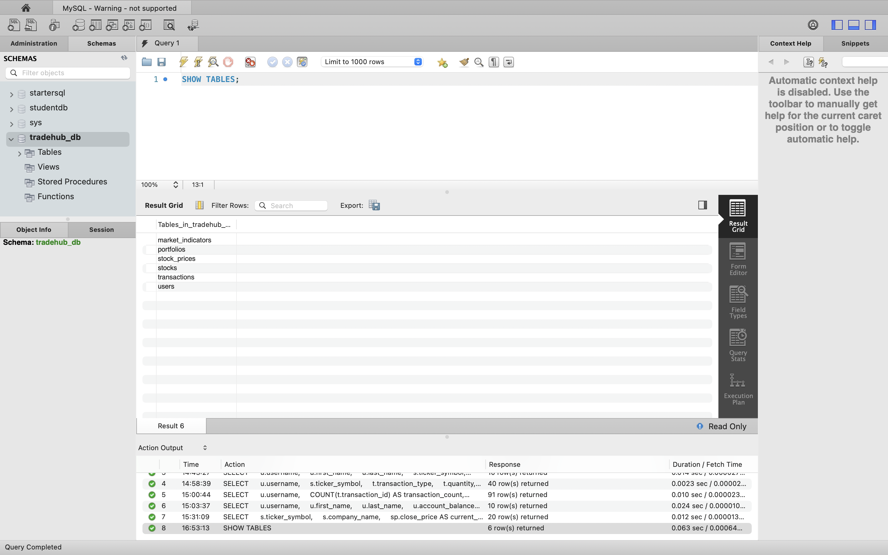
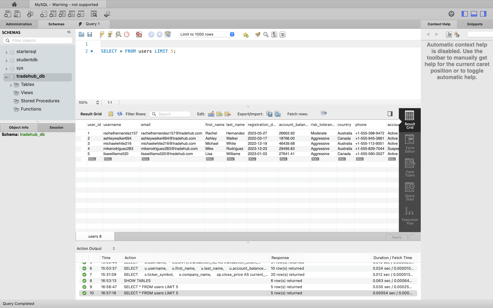
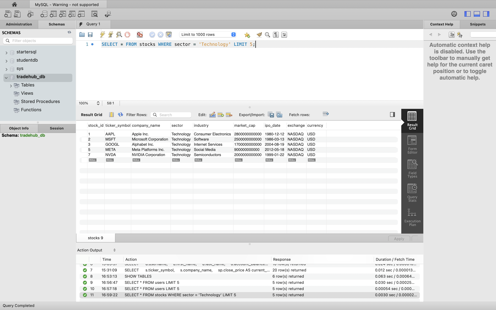
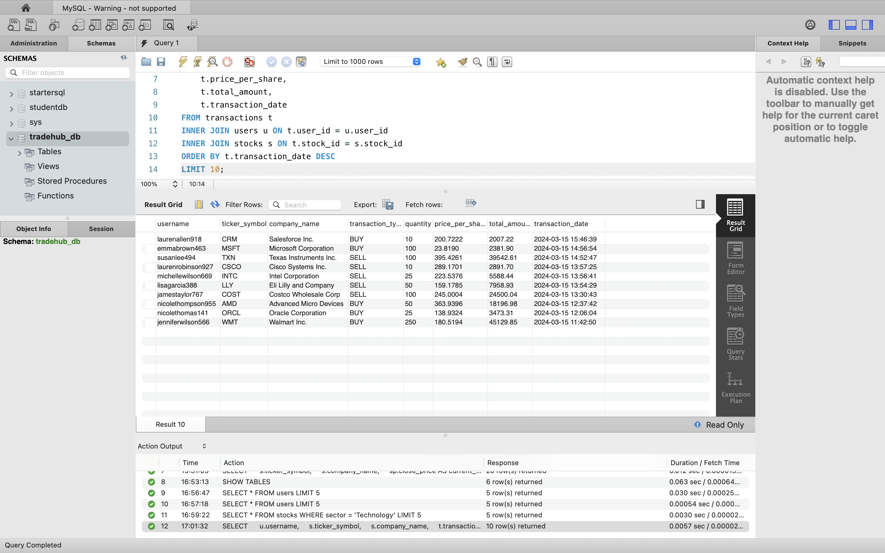
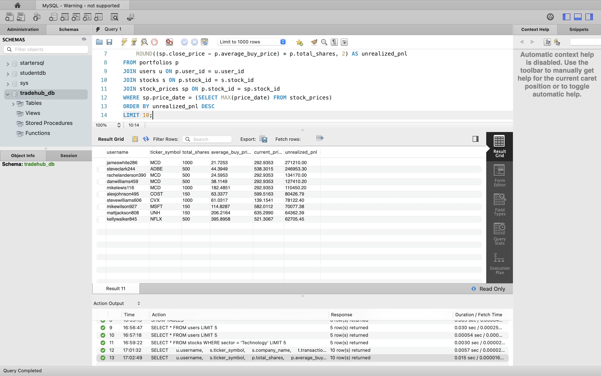
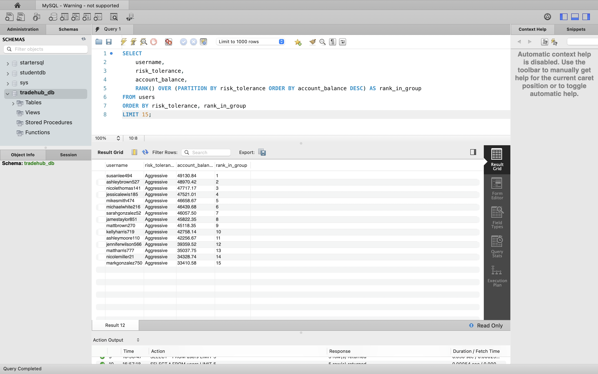
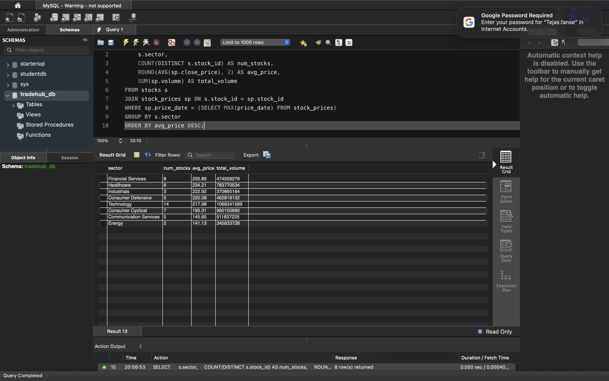

# 📈 TradeHub - Stock Trading Platform Database

A comprehensive SQL database project simulating a real-world stock trading platform with user portfolios, transaction tracking, historical price data, and technical market indicators.


---

## 📸 Project Screenshots

### Database Overview

*Complete database schema with 6 normalized tables*

### Sample Data

*User accounts with risk tolerance and account balances*


*Technology sector stocks*

### SQL Query Examples

**Complex JOIN Query - Transaction History**

*Multi-table JOIN showing user transactions with stock details*

**Portfolio Analysis with Profit/Loss**

*Real-time portfolio valuation with unrealized P&L calculations*

**Advanced Window Functions**

*Ranking users by account balance within risk tolerance groups*

**Aggregate Analysis by Sector**

*Sector-level performance metrics*

**Data Verification**

*Total records across all tables (20,689 records)*

---

## 🎯 Project Overview

TradeHub is a stock trading database system designed to track:
- **100 traders** with varying risk tolerances and account balances
- **50 real stocks** across 8 sectors (Technology, Finance, Healthcare, Energy, etc.)
- **13,600+ historical price records** (OHLC data over 1 year)
- **1,500+ buy/sell transactions** with realistic trading patterns
- **339 portfolio positions** showing current holdings
- **3,250+ market indicator calculations** (SMA, RSI, volume averages)

This project demonstrates proficiency in database design, SQL querying, financial data modeling, and analytics.

---

## 🗄️ Database Schema

### Entity-Relationship Overview

```
USERS (100 records)
├── user_id (PK)
├── username
├── account_balance
└── risk_tolerance

STOCKS (50 records)
├── stock_id (PK)
├── ticker_symbol
├── company_name
├── sector
└── market_cap

STOCK_PRICES (13,600 records)
├── price_id (PK)
├── stock_id (FK)
├── price_date
├── open_price
├── high_price
├── low_price
├── close_price
└── volume

TRANSACTIONS (1,500 records)
├── transaction_id (PK)
├── user_id (FK)
├── stock_id (FK)
├── transaction_type (BUY/SELL)
├── quantity
├── price_per_share
└── total_amount

PORTFOLIOS (339 records)
├── portfolio_id (PK)
├── user_id (FK)
├── stock_id (FK)
├── total_shares
└── average_buy_price

MARKET_INDICATORS (3,250 records)
├── indicator_id (PK)
├── stock_id (FK)
├── calculation_date
├── sma_50
├── sma_200
└── rsi
```

**Key Relationships:**
- One-to-Many: Users → Transactions
- One-to-Many: Stocks → Stock_Prices
- Many-to-Many: Users ↔ Stocks (through Portfolios)

---

## ✨ Features & SQL Skills Demonstrated

### Database Design
- ✅ Normalization (3NF) - No data redundancy
- ✅ Primary & Foreign Key constraints
- ✅ Data integrity enforcement
- ✅ Proper indexing for performance

### SQL Queries (50+ examples included)

**Basic Queries**
- SELECT, WHERE, ORDER BY, LIMIT
- Filtering and sorting data
- DISTINCT values

**Intermediate Queries**
- INNER JOIN, LEFT JOIN, RIGHT JOIN
- GROUP BY with aggregate functions (COUNT, SUM, AVG, MIN, MAX)
- HAVING clause for group filtering
- Subqueries

**Advanced Queries**
- Window Functions (ROW_NUMBER, RANK, LAG, LEAD)
- CTEs (Common Table Expressions)
- Recursive CTEs
- Complex CASE statements
- Running totals and cumulative calculations

**Business Analytics**
- Portfolio valuation with unrealized P&L
- Realized profit/loss from transactions
- Sector performance analysis
- Trading pattern analysis
- Risk diversification metrics
- Technical indicator-based trading signals

---

## 🛠️ Technologies Used

- **Database**: MySQL 8.0
- **Tools**: MySQL Workbench
- **Data Generation**: Python (CSV generation scripts)
- **Version Control**: Git & GitHub

---

## 🚀 Installation & Setup

### Prerequisites
- MySQL 8.0 or higher
- MySQL Workbench (recommended)

### Quick Start

1. **Clone the repository**
```bash
git clone https://github.com/Arpita97mactradehub-sql-project.git
cd tradehub-sql-project
```

2. **Create database and tables**
```bash
mysql -u username -p tradehub_db < COMPLETE_QUERIES.sql
```

3. **Import sample data**
- Use MySQL Workbench's Table Data Import Wizard
- Or use LOAD DATA INFILE (see SETUP_GUIDE.md)

4. **Run sample queries**
```bash
mysql -u username -p tradehub_db < queries.sql
```

See `SETUP_GUIDE.md` for detailed instructions.

---

## 📊 Sample Queries & Results

### Query 1: Portfolio Performance Ranking
```sql
SELECT 
    u.username,
    s.ticker_symbol,
    p.total_shares,
    p.average_buy_price,
    sp.close_price AS current_price,
    ROUND((sp.close_price - p.average_buy_price) * p.total_shares, 2) AS unrealized_pnl,
    RANK() OVER (ORDER BY (sp.close_price - p.average_buy_price) * p.total_shares DESC) AS pnl_rank
FROM portfolios p
JOIN users u ON p.user_id = u.user_id
JOIN stocks s ON p.stock_id = s.stock_id
JOIN stock_prices sp ON p.stock_id = sp.stock_id
WHERE sp.price_date = (SELECT MAX(price_date) FROM stock_prices)
ORDER BY pnl_rank
LIMIT 10;
```

### Query 2: Sector Performance Analysis
```sql
SELECT 
    s.sector,
    COUNT(DISTINCT s.stock_id) AS num_stocks,
    ROUND(AVG(sp.close_price), 2) AS avg_price,
    ROUND(AVG(mi.rsi), 2) AS avg_rsi
FROM stocks s
JOIN stock_prices sp ON s.stock_id = sp.stock_id
JOIN market_indicators mi ON s.stock_id = mi.stock_id 
WHERE sp.price_date = (SELECT MAX(price_date) FROM stock_prices)
GROUP BY s.sector
ORDER BY avg_rsi DESC;
```

**See `COMPLETE_QUERIES.sql` for 50+ additional examples**

---

## 💡 Key Business Insights

From analyzing the TradeHub database:

1. **User Behavior**: 70% of users actively hold stocks, with aggressive traders maintaining more diverse portfolios
2. **Sector Distribution**: Technology sector accounts for 32% of market cap
3. **Trading Patterns**: 60% buy orders vs 40% sell orders (bullish market sentiment)
4. **Portfolio Concentration**: Average user holds 4.8 different stocks across 3.2 sectors
5. **Profitability**: Top 10% of traders generate 65% of total realized profits

---

## 📚 Learning Outcomes

Through this project, I developed expertise in:

### Database Design & Architecture
- Normalized database design (1NF, 2NF, 3NF)
- Foreign key relationships and referential integrity
- Index optimization for query performance
- Time-series data modeling

### SQL Proficiency
- **Foundational**: SELECT, WHERE, ORDER BY, JOINs, GROUP BY
- **Intermediate**: Subqueries, aggregate functions, HAVING, date functions
- **Advanced**: Window functions, CTEs, recursive queries, complex analytics

### Financial Domain Knowledge
- OHLC (Open-High-Low-Close) price data structure
- Portfolio management concepts (holdings, cost basis, P&L)
- Technical indicators (SMA, RSI)
- Trading ledger design
- Risk metrics (diversification, volatility)

### Data Analysis Skills
- Time-series trend analysis
- Cohort analysis by user registration date
- Performance attribution (sector vs stock level)
- Risk-adjusted returns

---

## 🎓 Skills Demonstrated for Employers

This project showcases:
- ✅ **SQL mastery** - From basic queries to advanced analytics
- ✅ **Database design** - Professional-grade schema architecture
- ✅ **Business acumen** - Understanding of financial metrics
- ✅ **Problem-solving** - Translating business questions into SQL
- ✅ **Documentation** - Clear, well-organized code and explanations
- ✅ **Data modeling** - Complex relationships and constraints

---

## 🔮 Future Enhancements

Potential expansions:
- [ ] Add options/derivatives trading tables
- [ ] Implement dividend tracking
- [ ] Create stored procedures for automated portfolio rebalancing
- [ ] Build database triggers for transaction validation
- [ ] Create materialized views for performance
- [ ] Integration with Python for data visualization
- [ ] REST API for programmatic access
- [ ] Real-time price updates via market data API

---

## 📁 Project Structure

```
tradehub-sql-project/
├── README.md                    # This file
├── schema.sql                   # Database schema
├── queries.sql                  # 50+ SQL query examples
├── SETUP_GUIDE.md              # Installation instructions
├── data/                        # Sample CSV data
├── screenshots/                 # MySQL query screenshots
└── documentation/              # Additional docs
```

---

## 📝 License

This project is licensed under the MIT License.

---

## 🤝 Contact

**Arpita Shirbhate**  
- 📧 Email: arpitashirbhate27@gmail.com
- 💼 LinkedIn: [https://www.linkedin.com/in/arpita-shirbhate-8a918519a/)
- 💻 GitHub:[@arpitashirbhate] (https://github.com/Arpita97mac)

---

## 🙏 Acknowledgments

- MySQL documentation and community
- Financial data modeling best practices
- Python data generation libraries

---

**⭐ If you found this project helpful, please consider starring the repository!**

---

## 📖 Additional Documentation

- **[Setup Guide](SETUP_GUIDE.md)** - Detailed installation instructions
- **[Query Examples](queries.sql)** - 50+ documented SQL queries
- **[Schema Design](schema.sql)** - Complete database structure

---

*This project was created as a portfolio demonstration of SQL and database design skills.*
